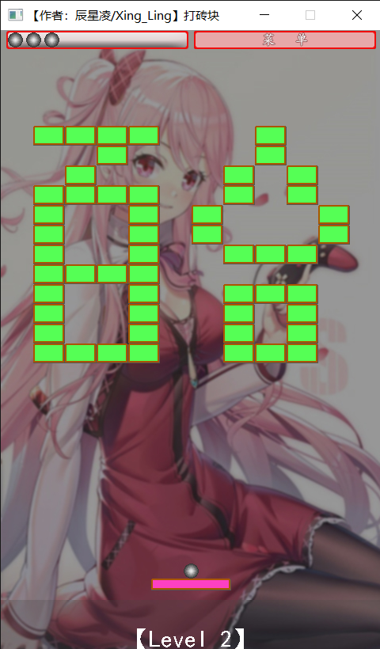
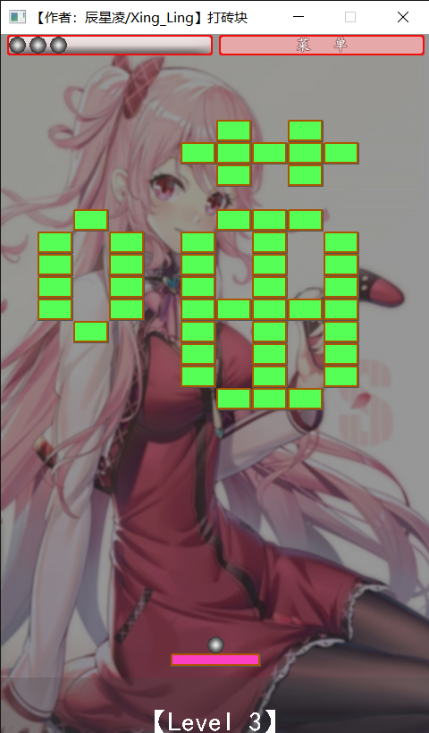
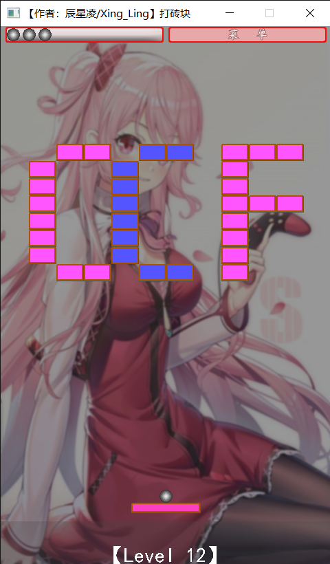
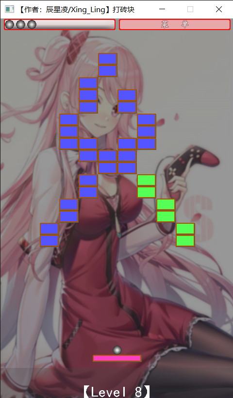

# **【编程开发】用 EasyX 写 UI 开发一个好看好玩的小游戏：打砖块**

$\text{update 2021.12.5}:$ 打砖块v1.0发布。

$\text{update 2021.11.16}:$ 应 Silent_E 要求，[开发日志](https://www.cnblogs.com/Xing-Ling/p/15563183.html)放在博客上实时更新。

$\text{update 2021.10.12}:$ 咕了一年零八个月，终于是重拾了这项工程。

------------------

## **一：【更新日志log】**

当前版本： [【Github】打砖块v1.0](https://github.com/ChenXingLing/Breakout) 

更新日志：[【编程开发】C++ 打砖块开发日志](https://www.cnblogs.com/Xing-Ling/p/15563183.html)

### **1.【版本更新汇总】**

#### (1).打砖块v1.0 (2021.12.5)

初版，只有一些基本的核心机制，18个基础关卡，做了一部分贴图。
（提示：在开始界面或者选择关卡界面按下shift+O可以开挂实现关卡全开）

### **2.【挖坑】**

等待实现的功能:   
- 开发-资源文件内嵌打包  
- 关卡设计-基础关卡  
- 关卡设计-无尽模式  
- 关卡设计-关卡自由生成  
- UI设计-玩家贴图
- UI设计-砖块贴图
- UI设计-游戏说明
- UI设计-游戏音效
- UI设计-游戏数据存档
- 机制-砖块-多级硬度  
- 机制-砖块-无穷硬度  
- 机制-砖块-周期移动砖块  
- 道具-回血  
- 道具-降血  
- 道具-小球1:增大  
- 道具-小球2:缩小  
- 道具-小球3:横冲直撞  
- 道具-小球4:数量增加  
- 道具-小球5:加速  
- 道具-小球6:减速  
- 道具-玩家1:伸长  
- 道具-玩家2:缩短  
- 道具-玩家3:黏性发射  
- 道具-玩家4:发射子弹攻击  

------------------

## **二：【演示Demo】**

